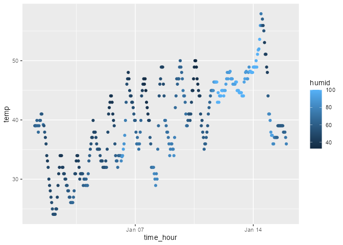

Homework 1
================
Maliha Safdar (ms7354)
2025-09-18

#### **Problem 1: Solution**

In this first problem we will look at the behavior of the ggplot for
different types of variables. The “early_january_weather” dataset has
hourly meteorilogical data for LGA,JFK and EWR from January 2013. The
size of the dataset is 358 rows and 15 columns. It has 15 variables and
their names are as follows:

``` r
nrow(early_january_weather) # number of rows
```

    ## [1] 358

``` r
ncol(early_january_weather) # number of columns
```

    ## [1] 15

``` r
colnames(early_january_weather) # names of variables
```

    ##  [1] "origin"     "year"       "month"      "day"        "hour"      
    ##  [6] "temp"       "dewp"       "humid"      "wind_dir"   "wind_speed"
    ## [11] "wind_gust"  "precip"     "pressure"   "visib"      "time_hour"

``` r
mean(early_january_weather$temp) # mean temperature
```

    ## [1] 39.58212

The mean temperature is 39.85 F.

##### Scatterplot for Temperature versus Time

``` r
install.packages("ggplot2")
```

    ## Warning: package 'ggplot2' is in use and will not be installed

``` r
library(ggplot2)
```

``` r
ggplot(early_january_weather, aes(x=time_hour, y=temp, color = humid)) +
  geom_point()
```

<!-- -->

``` r
ggsave
```

    ## function (filename, plot = get_last_plot(), device = NULL, path = NULL, 
    ##     scale = 1, width = NA, height = NA, units = c("in", "cm", 
    ##         "mm", "px"), dpi = 300, limitsize = TRUE, bg = NULL, 
    ##     create.dir = FALSE, ...) 
    ## {
    ##     filename <- validate_path(path, filename, create.dir)
    ##     dpi <- parse_dpi(dpi)
    ##     dev <- validate_device(device, filename, dpi = dpi)
    ##     dim <- plot_dim(c(width, height), scale = scale, units = units, 
    ##         limitsize = limitsize, dpi = dpi)
    ##     bg <- get_plot_background(plot, bg)
    ##     old_dev <- grDevices::dev.cur()
    ##     dev(filename = filename, width = dim[1], height = dim[2], 
    ##         bg = bg, ...)
    ##     on.exit(utils::capture.output({
    ##         grDevices::dev.off()
    ##         if (old_dev > 1) grDevices::dev.set(old_dev)
    ##     }))
    ##     if (!is_bare_list(plot)) {
    ##         plot <- list(plot)
    ##     }
    ##     lapply(plot, grid.draw)
    ##     invisible(filename)
    ## }
    ## <bytecode: 0x000002cb75b40318>
    ## <environment: namespace:ggplot2>

What I can observe from the scatterplot above is that as the temperature
fluctuates between 40 degrees Farenheit to about 60 degrees Fareheit as
time increases. The humidity can be seen to increase in the midpoint of
Jan 7th and Jan 14th when the temperature is around 49 degrees
Farenheit.

#### **Problem 2: Solution**

The sugar_df is a data frame that has information of amount of sugar in
different fruits and the level of sugar each one has. It is a fictional
dataframe I created so it is inaccurate.

``` r
set.seed(1234)
   vec_numeric = rnorm(10)
   vec_logical = vec_numeric > 0
   vec_char = c("apple","banana","cherry","dragonfruit","elderberry","fig","grapes","lychee","pineapple","mango")
   levels3 <- c("low", "medium", "high")
     vec_factor = factor(sample(levels3, size = 10, replace = TRUE), levels3)
```

``` r
sugar_df <- data.frame(
     sugar_amount = vec_numeric,
     sugar_grt_ten = vec_logical,
     fruit = vec_char,
     sugar_level = vec_factor
     )
```

``` r
(sugar_df)
```

    ##    sugar_amount sugar_grt_ten       fruit sugar_level
    ## 1    -1.2070657         FALSE       apple      medium
    ## 2     0.2774292          TRUE      banana      medium
    ## 3     1.0844412          TRUE      cherry      medium
    ## 4    -2.3456977         FALSE dragonfruit         low
    ## 5     0.4291247          TRUE  elderberry        high
    ## 6     0.5060559          TRUE         fig        high
    ## 7    -0.5747400         FALSE      grapes        high
    ## 8    -0.5466319         FALSE      lychee         low
    ## 9    -0.5644520         FALSE   pineapple      medium
    ## 10   -0.8900378         FALSE       mango         low

``` r
mean(sugar_df$sugar_amount) #mean for sugar_amount
```

    ## [1] -0.3831574

``` r
mean(sugar_df$sugar_grt_ten) #mean for sugar_grt_ten
```

    ## [1] 0.4

``` r
mean(sugar_df$fruit)        #mean for fruit
```

    ## Warning in mean.default(sugar_df$fruit): argument is not numeric or logical:
    ## returning NA

    ## [1] NA

``` r
mean(sugar_df$sugar_level)  # mean for sugar_level
```

    ## Warning in mean.default(sugar_df$sugar_level): argument is not numeric or
    ## logical: returning NA

    ## [1] NA

When I took the mean of each variable I noticed that only the mean for
sugar_amount (-0.38) and sugar_grt_0 (0.4) were populated. For the other
two categorical variables no mean was populated.
