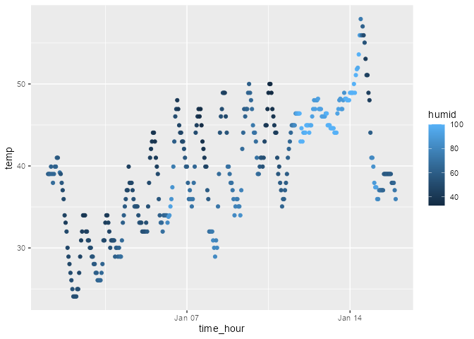

Homework 1
================
Maliha Safdar (ms7354)
2025-09-18

``` r
library(moderndive)
library(tidyverse)
```

    ## ── Attaching core tidyverse packages ──────────────────────── tidyverse 2.0.0 ──
    ## ✔ dplyr     1.1.4     ✔ readr     2.1.5
    ## ✔ forcats   1.0.0     ✔ stringr   1.5.1
    ## ✔ ggplot2   4.0.0     ✔ tibble    3.3.0
    ## ✔ lubridate 1.9.4     ✔ tidyr     1.3.1
    ## ✔ purrr     1.1.0     
    ## ── Conflicts ────────────────────────────────────────── tidyverse_conflicts() ──
    ## ✖ dplyr::filter() masks stats::filter()
    ## ✖ dplyr::lag()    masks stats::lag()
    ## ℹ Use the conflicted package (<http://conflicted.r-lib.org/>) to force all conflicts to become errors

``` r
data("early_january_weather", package = "moderndive")
```

#### **Problem 1: Solution**

``` r
nrow(early_january_weather) # number of rows
```

    ## [1] 358

``` r
ncol(early_january_weather) # number of columns
```

    ## [1] 15

`In this first problem we will look at the behavior of the ggplot for different types of variables. The "early_january_weather" dataset has hourly meteorological data for LGA,JFK and EWR from January 2013. The size of the dataset is 358 rows and 15 columns. It has 15 variables and their names are as follows:`

``` r
colnames(early_january_weather) # names of variables
```

    ##  [1] "origin"     "year"       "month"      "day"        "hour"      
    ##  [6] "temp"       "dewp"       "humid"      "wind_dir"   "wind_speed"
    ## [11] "wind_gust"  "precip"     "pressure"   "visib"      "time_hour"

``` r
mean(early_january_weather$temp) # mean temperature
```

    ## [1] 39.58212

`The mean temperature is 39.58 F.`

##### Scatterplot for Temperature versus Time

``` r
ggplot(early_january_weather, aes(x=time_hour, y=temp, color = humid)) +
  geom_point()
```

<!-- -->

``` r
ggsave("scatter_plot.pdf", height = 4, width = 6)
```

`What I can observe from the scatterplot above is that as the temperature fluctuates between 40 degrees Farenheit to about 60 degrees Fareheit as time increases. The humidity can be seen to increase in the midpoint of Jan 7th and Jan 14th when the temperature is around 49 degrees Farenheit.`

#### **Problem 2: Solution**

`The sugar_df is a data frame that has information of amount of sugar in different fruits and the level of sugar each one has. It is a fictional dataframe I created so it is inaccurate.`

``` r
   vec_numeric = rnorm(10)
   vec_logical = vec_numeric > 0
   vec_char = c("apple","banana","cherry","dragonfruit","elderberry","fig","grapes","lychee","pineapple","mango")
     vec_factor = factor(c("high sugar level","high sugar level","medium sugar level","low sugar level","low sugar level","medium sugar level","medium sugar level","low sugar level","high sugar level","medium sugar level"))
```

``` r
sugar_df <- data.frame(
     sugar_amount = vec_numeric,
     sugar_grt_ten = vec_logical,
     fruit = vec_char,
     sugar_level = vec_factor
     )
```

``` r
(sugar_df)
```

    ##    sugar_amount sugar_grt_ten       fruit        sugar_level
    ## 1    -0.1511875         FALSE       apple   high sugar level
    ## 2     0.2745772          TRUE      banana   high sugar level
    ## 3     0.4957547          TRUE      cherry medium sugar level
    ## 4    -0.7099769         FALSE dragonfruit    low sugar level
    ## 5    -0.7732686         FALSE  elderberry    low sugar level
    ## 6    -0.3176869         FALSE         fig medium sugar level
    ## 7    -0.8104137         FALSE      grapes medium sugar level
    ## 8    -0.1947511         FALSE      lychee    low sugar level
    ## 9     1.2468437          TRUE   pineapple   high sugar level
    ## 10   -0.8924190         FALSE       mango medium sugar level

``` r
mean(sugar_df$sugar_amount) #mean for sugar_amount
```

    ## [1] -0.1832528

``` r
mean(sugar_df$sugar_grt_ten) #mean for sugar_grt_ten
```

    ## [1] 0.3

``` r
mean(sugar_df$fruit)        #mean for fruit
```

    ## Warning in mean.default(sugar_df$fruit): argument is not numeric or logical:
    ## returning NA

    ## [1] NA

``` r
mean(sugar_df$sugar_level)  # mean for sugar_level
```

    ## Warning in mean.default(sugar_df$sugar_level): argument is not numeric or
    ## logical: returning NA

    ## [1] NA

`When I took the mean of each variable I noticed that only the mean for sugar_amount (-0.38) and sugar_grt_0 (0.4) were populated. For the other two categorical variables no mean was populated.`

#### Using the pull function

`I pulled my variables from my sugar_df.`

``` r
pull(sugar_df,sugar_amount)
```

    ##  [1] -0.1511875  0.2745772  0.4957547 -0.7099769 -0.7732686 -0.3176869
    ##  [7] -0.8104137 -0.1947511  1.2468437 -0.8924190

``` r
pull(sugar_df,sugar_grt_ten)
```

    ##  [1] FALSE  TRUE  TRUE FALSE FALSE FALSE FALSE FALSE  TRUE FALSE

``` r
pull(sugar_df,fruit)
```

    ##  [1] "apple"       "banana"      "cherry"      "dragonfruit" "elderberry" 
    ##  [6] "fig"         "grapes"      "lychee"      "pineapple"   "mango"

``` r
pull(sugar_df,sugar_level)
```

    ##  [1] high sugar level   high sugar level   medium sugar level low sugar level   
    ##  [5] low sugar level    medium sugar level medium sugar level low sugar level   
    ##  [9] high sugar level   medium sugar level
    ## Levels: high sugar level low sugar level medium sugar level
